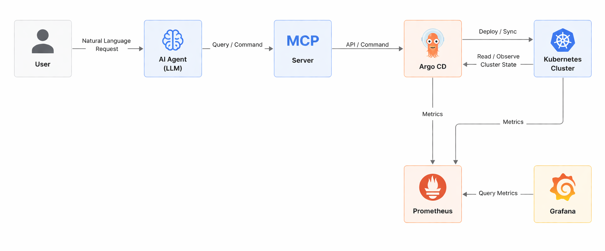

# Acronym: ARGO-CD
# Title: Argo workflow organization and observability

**Authors:** 
- Maciej Michoń 
- Jakub Rękas
- Piotr Rusak
- Ernest Szlamczyk

**Year:** 2026
**Group:** 5

## Contents list
1. [Introduction](#1-introduction)
2. [Theoretical background/technology stack](#2-theoretical-backgroundtechnology-stack)
    * [2.1 ArgoCD](#21-argocd)
    * [2.2 LLM and Promoting Interface](#22-llm-and-promoting-interface)
    * [2.3 Model Context Protocol (MCP)](#23-model-context-protocol-mcp)
    * [2.4 Observability - Prometheus](#24-observability---prometheus)
    * [2.5 Visualization - Grafana](#25-visualization---grafana)
3. [Case study concept description](#3-case-study-concept-description)
    * [3.1 Application deployment & LLM Interaction](#31-application-deployment--llm-interaction)
    * [3.2 Observability](#32-observability)
    * [3.3 Visualization](#33-visualization)
4. [Case study high level architecture](#4-case-study-high-level-architecture)
5. [Case study detailed architecture](#5-case-study-detailed-architecture)
6. [Environment configuration description](#6-environment-configuration-description)
7. [Installation method](#7-installation-method)
    * [7.1 Cluster Initialization](#71-cluster-initialization)
    * [7.2 ArgoCD Installation](#72-argocd-installation)
    * [7.3 Application Build and Local Registry](#73-application-build-and-local-registry)
    * [7.4 Accessing the ArgoCD UI](#74-accessing-the-argocd-ui)
8. [Demo deployment steps](#8-demo-deployment-steps)
    * [Configuration set-up](#configuration-set-up)
    * [Data preparation](#data-preparation)
9. [Demo description](#9-demo-description)
    * [Execution procedure](#execution-procedure)
        * [GitOps Mutation](#gitops-mutation)
        * [Telemetry Verification](#telemetry-verification)
        * [LLM-Driven Management](#llm-driven-management)
    * [Results presentation](#results-presentation)
10. [Summary - conclusions](#10-summary---conclusions)
11. [References](#11-references)

---

## 1. Introduction
The main objective of this project is to demonstrate modern continuous delivery workflow organization using `Argo CD`, enhanced by Large Language Models through the `Model Context Protocol (MCP)`, and fully monitored using `Prometheus` and `Grafana`. In modern DevOps, managing complex Kubernetes deployments can be challenging. This project aims to bridge the gap between (technical and non technical) human operators and deployment infrastructure by allowing natural language interactions with Argo CD via LLM assistants, while maintaining strict observability and visualization of the deployment states.

## 2. Theoretical background/technology stack
This project utilizes the "Type 1" project architecture model, integrating the following key technologies:

### 2.1. **ArgoCD**
Argo CD is a declarative `GitOps` `CD` (Continuous Delivery) tool for Kubernetes. This tool helps application definitions, configurations and environments to remain declarative and version controlled. Argo also allows application deployment and lifecycle management to be automated, auditable and easy to understand.

Argo follows `GitOps` patters of using Git repos as the source of truth for defining the desired application state. This is implemented as a Kubernetes controller which continuously monitors running applications and compares the current state against the desired git repo state. Deployed application whose live state deviates from the target state is considered `OutOfSync`. Argo then reports and visualizes the differences while providing tools to automatically or manually sync the state.

### 2.2 LLM and Promoting Interface
Large Language Models (e.g. Claude, Cursor, ChatGPT) act as the reasoning engine for the operator, transforming natural language intentions into API actions.

### 2.3 Model Context Protocol (MCP):
MCP (Model Context Protocol) is an open-source standard for connecting AI applications to external systems.

Using MCP, AI applications like Claude or ChatGPT can connect to data sources (e.g. local files, databases), tools (e.g. search engines, calculators) and workflows (e.g. specialized prompts)—enabling them to access key information and perform tasks.

We will use [Argo CD MCP Server](https://github.com/argoproj-labs/mcp-for-argocd). And implementation of the MCP standard for the ArgoCD, enabling integrations with `Visual Studio Code` and other MCP clients through `standard io` and `HTTP` stream transport protocols.

### 2.4 Observability - Prometheus

Prometheus is an open-source systems monitoring and alerting toolkit originally built at `SoundCloud`. Prometheus collects and stores its metrics as time series data, i.e. metrics information is stored with the timestamp at which it was recorded, alongside optional key-value pairs called labels.

#### What are metrics?
Metrics are numerical measurements in layperson terms. The term time series refers to the recording of changes over time. What users want to measure differs from application to application. For a web server, it could be request times; for a database, it could be the number of active connections or active queries, and so on.
Metrics are useful for tasks such as `auto-scaling`. For example, when the number of requests is high, the application may become slow. If the app has the request count metric, it can determine the cause and increase the number of servers to handle the load.

### 2.5 Visualization - Grafana:

Grafana is an open-source tool that enables querying, visualization and exploring of metrics, logs and traces whenever they're stored. Grafana data source plugins enables cooperation between itself and Prometheus. It allows creation of interactive dashboards based on the data itself, allowing operators to visually track the health and performance of the GitOps Workflows.


## 3. Case study concept description

The case study is designed to demonstrate a modernized, GitOps workflow. It simulates a realistic operational scenario where an administrator manages a Kubernetes application deployment not through traditional CLI commands or complex YAML editing, but through natural language interaction, while maintaining complete system observability. 

The concept is divided into three core pillars:

### 3.1 Application deployment & LLM Interaction
The core application workflow centers around a sample Kubernetes deployment whose desired state is stored in a Git repository. Argo CD is responsible for continuously monitoring this repository and ensuring the Kubernetes cluster matches the defined state.
Instead of interacting with Argo CD directly via its UI or CLI, the operator uses an AI agent. The Argo CD MCP server is helpful here'. When the operator types a prompt like, *"Check if the frontend application is out of sync and deploy the latest changes,"* the LLM translates this intent into specific tool calls via the MCP server. The MCP server then executes the corresponding Argo CD API commands to retrieve the status or trigger a synchronization.

### 3.2 Observability
To ensure the automated deployments are functioning correctly, strict observability is applied to the Argo CD infrastructure. Prometheus is configured to scrape metrics directly from Argo CD's built-in `/metrics` endpoints. 
The case study focuses on capturing critical GitOps metrics, including:
- Real-time data on whether the deployed application is `Synced`, `OutOfSync`, `Healthy`, or `Degraded`.
- How long it takes Argo CD to compare the Git repository state with the live cluster state.
- Tracking the volume of API requests, which is particularly important to monitor the frequency of actions triggered by the LLM via the MCP server.

### 3.3 Visualization
The raw time-series data collected by Prometheus is translated into actionable insights using Grafana. The case study will feature a Grafana dashboard tailored specifically for this LLM-enhanced GitOps pipeline. 

## 4. Case study high level architecture

The high-level architecture of this case study follows a closed-loop system where deployment, AI-driven management, and monitoring occur continuously. The architecture consists of the following interacting layers:

### 1. The Source of Truth
- Git repository hosts the declarative Kubernetes manifests, like YAML files, that define the desired state of the target application.

### 2. The Management & Execution Layer
- Argo CD is the central controller running within the Kubernetes cluster. It continuously polls the git repository, compares it against the live cluster state, and applies changes to synchronize them. It also exposes APIs for external control and metrics for monitoring.
- Target Kubernetes environment is the infrastructure where the application workloads are actually provisioned and run.

### 3. The AI Interaction Layer (MCP Stack)
- An AI agent is the user interface  where the user inputs natural language commands.
- Argo CD MCP server is the standard interface that sits between the LLM and Argo CD. It exposes Argo CD's capabilities as "tools" that the LLM can understand and execute via secure API calls.

### 4. The Observability Layer (Monitoring Stack)
- Prometheus operates within the cluster, utilizing a pull-based mechanism to periodically scrape metric data from Argo CD's endpoints and the target application.
- Grafana connects to Prometheus as its primary data source. It provides the visual dashboard layer, querying Prometheus to render the current and historical state of the deployment workflows in real-time.

### Data Flow Summary:
1. The user issues a natural language request to the AI agent.
2. The LLM uses the MCP server to query or command Argo CD.
3. Argo CD fetches the latest state from the git repository and updates the Kubernetes cluster.
4. Simultaneously, Prometheus scrapes operational metrics from Argo CD.
5. Grafana queries Prometheus to visualize the outcome of the actions triggered by the LLM and the overall health of the system.



## 5. Case study detailed architecture
THe architecture is built upon a local Kubernetes cluster (using Minikube for simplicity) and structured into isolated namespaces to separate infra from the business:

1. Infra namespace (`argocd`):
    - Hosts the ArgoCD control plane (`argocd-server`, `argocd-repo-server`, `argocd-application-controller`).
    - The `argocd-server` exposed Web UI and an API.
    - ... **todo MCP STUFF**

2. Business namespace (`default`):
    - The core business logic (`auth-api`) is a API written in Elixir with Phoenix, running in a Docker container. It includes the `PromEx` library to expose internal `BEAM` and `HTTP` metrics at `/metrics` endpoint.
    - PostgreSQL (`postgres-db`) database deployed as a Kubernetes Deployment and Service, providing persistence layer for Phoenix API. 

3. Observability Integration:
    - Kubernetes Service resources are adnotated with `prometheus.io/scrape: "true"` and `prometheus.io/port: "4000"`. This enables the Prometheus Operator to automatically discover the application and scrape its telemetry data.
    - ... **TODO OBSERVABILITY**

## 6. Environment configuration description
To replicate and run this environment, the following tools need to be installed on user's machine:
- **Docker** (or docker desktop) for running the application images and running the *Minikube cluster*.
- **Minikube** for local Kubernetes cluster emulator.
- **kubectl** for kubernetes `CLI`
- **git** (obviously)
- **Github Account with write permissions in the given repository** (obviously)

The network configuration involves exposing the `Argo CD UI` via port-forwarding (on `localhost:8080`) and exposing the Phoenix API via a Kubernetes `NodePort` (e.g. port `30000`), allowing direct HTTP traffic from the host machine for testing and metrics scraping.

## 7. Installation method
The installation follows a declarative `GitOps-first` approach. Users/Developers should follow these precise steps to set up the environment:

#### 7.1 Cluster Initialization
Start the local Kubernetes cluster:
```bash
minikube start
```

#### 7.2 ArgoCD Installation
Install the `ArgoCD` control plane into a dedicated namespace. Due to size of the CustomResourceDefinitions(`CRDs`), server-side apply is required to avoid annotation size limits:
```bash
kubectl create namespace argocd

kubectl apply -n argocd -f https://raw.githubusercontent.com/argoproj/argo-cd/stable/manifests/install.yaml --server-side --force-conflicts
```

#### 7.3 Application Build and Local Registry
Build the Elixir/Phoenix application Docker image and load it directly into Minikube's local registry to avoid pushing it to public internet registries:
```bash
docker build -t auth-api:local -f app.Dockerfile .
minikube image load auth-api:local
```

#### 7.4 Accessing the ArgoCD UI
Extract the initial admin password and forward the UI port:
```bash
kubectl -n argocd get secret argocd-initial-admin-secret -o jsonpath="{.data.password}" | base64 -d && echo
kubectl port-forward svc/argocd-server -n argocd 8080:443
```
The UI is now accessible at https://localhost:8080 using username `admin` and the password returned from the first command.

*Note: the certificates are not configured, but unless user decides to give themselves a malware, this can be ignored*  

## 8. Demo deployment steps

### Configuration set-up
The foundation of the deployment requires a `GitHub` repository containing the Kubernetes manifests (`Deployment`,`Service` and `Secret`). The repository must include them in `k8s` directory (both for database and elixir app).

Crucially, the connection string for *ecto* (database connection) must be provided via base64 encoded secret:

```yaml
apiVersion: v1
kind: Secret
metadata:
  name: auth-secrets
type: Opaque
data:
  DATABASE_URL: ZWN0bzovL3Bvc3RncmVzX2F1dGg6cGFzc3dvcmRAcG9zdGdyZXMtZGI6NTQzMi9wb3N0Z3Jlc19hdXRo
```

### Data preparation
Instead of manually applying the `k8s` manifests, the developer applies a single "trigger" manifest called `argo-app.yml` directly to the cluster. This file instructs ArgoCD to observe the git repository:

```yaml
apiVersion: argoproj.io/v1alpha1
kind: Application
metadata:
  name: phoenix-auth-system
  namespace: argocd
spec:
  project: default
  source:
    repoURL: https://github.com/username/repository.git # Must be updated to actual repo
    targetRevision: master
    path: k8s
  destination:
    server: https://kubernetes.default.svc
    namespace: default
  syncPolicy:
    automated:
      prune: true
      selfHeal: true
```

Then this file needs to be applied (via `kubectl apply -f argo-app.yml`). This hands over full control of the application lifecycle to ArgoCD. 

## 9. Demo description

Demo can be separated into three scenarios:
- GitOps mutation
- Telementry verificiation
- LLM-Driven management

### Execution procedure

#### GitOps Mutation
The operator modifies the `k8s/app.yaml` file in git repository (for example changes amount of replicas). After running `git push` (or merging pull request), everyone should observe ArgoCD automatically detecting the drift and provisioning two additional pods without any `kubectl` commands

#### Telemetry Verification
Using `minikube service auth-api --url` the operator accesses the application's `/metrics` endpoint with raw `PromEx` telemetry data.

**TODO PROMETHEUS AND GRAFANA**

#### LLM-Driven Management

**TODO KRZEM**

### Results presentation
The success of the implementation is verified visually through:

- Displaying a green  "Healthy" and "Synced" tree of resources in Argo CD Dashboard. This means that we provided successful GitOps delivery.
- Showing successful database connections and API readiness via API logs.
- The LLM client successfully parsing and displaying Kubernetes structural data fetched via the Argo CD API.

## 10. Summary - conclusions
The integration of Argo CD, observability tools, and LLMs via the Model Context Protocol represents a significant leap forward in Kubernetes cluster management.

By using `git` as the single source of truth, the project eliminates configuration drift between expected code and code actually running on the cluster. Usage of ArgoCD removes need of building and publishing containers via much worse CD solutions (such as *GitHub Actions* which are known for high pricing and bad performance). 

**TODO LLM KONKLUZJE**

## 11. References
1. ArgoCD official docs: [https://argo-cd.readthedocs.io/en/stable](https://argo-cd.readthedocs.io/en/stable)
2. Model Context Protocol (MCP) specs: [https://modelcontextprotocol.io/docs/getting-started/intro](https://modelcontextprotocol.io/docs/getting-started/intro)
3. Argo CD MCP server implementation: [https://github.com/argoproj-labs/mcp-for-argocd](https://github.com/argoproj-labs/mcp-for-argocd)
4. Elixir PromEx docs: [https://hexdocs.pm/prom_ex/readme.html](https://hexdocs.pm/prom_ex/readme.html)


*Special thanks to claude for helping me vibecode the telemetry app*